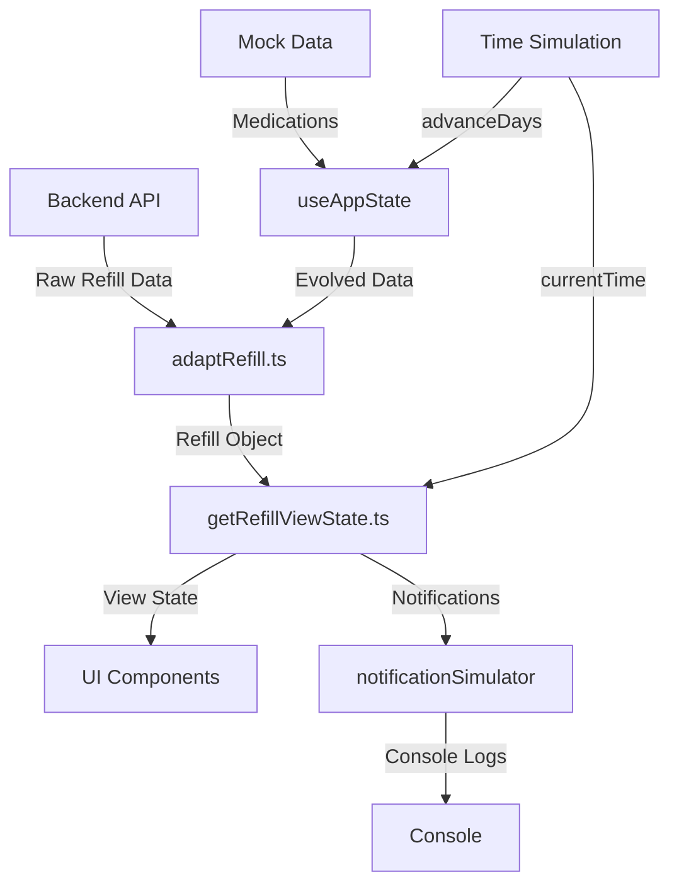
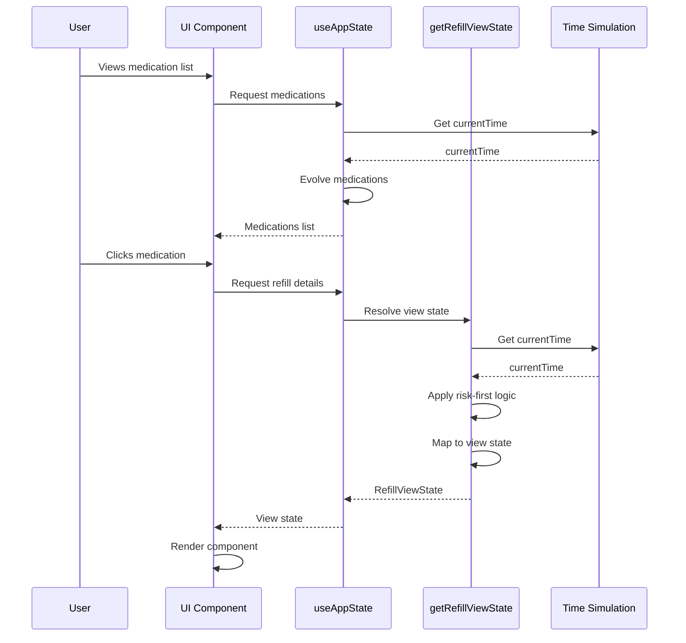
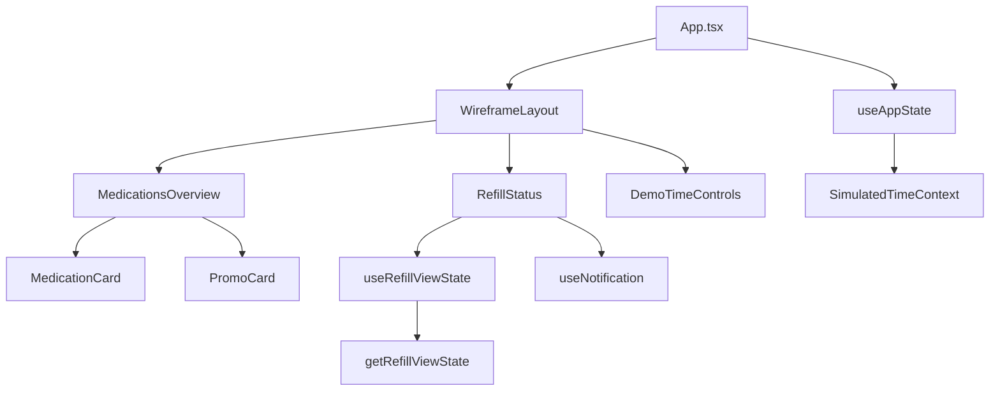
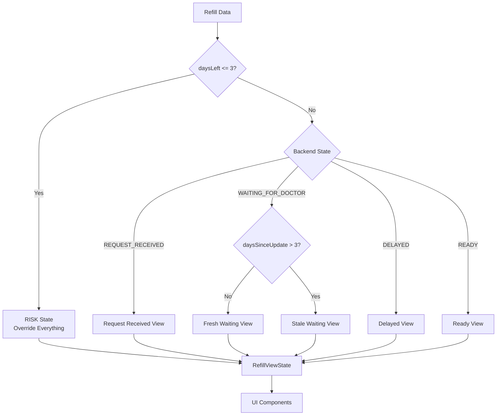

# Ultracare Pharmacy Refill App

A healthcare-focused medication refill tracking application built with React and TypeScript. This app provides a clean, accessible interface for patients to monitor their prescription refill status with intelligent state resolution, risk-first logic, and real-time updates.

## 📋 Table of Contents

- [Overview](#overview)
- [Features](#features)
- [Technology Stack](#technology-stack)
- [Architecture](#architecture)
- [Project Structure](#project-structure)
- [Setup & Installation](#setup--installation)
- [How It Works](#how-it-works)
- [Development Guide](#development-guide)
- [GitHub Setup](#github-setup)

---

## Overview

The Ultracare Pharmacy Refill App is a patient-facing application that displays medication refill status in a clear, reassuring manner. The app uses a centralized resolver pattern to transform raw backend states into user-friendly view states, with special handling for urgent situations (low medication supply).

### Key Design Principles

- **Healthcare-First**: Designed for older users with accessibility in mind
- **Risk-First Logic**: Urgent situations (low medication supply) override all other states
- **Zero Business Logic in UI**: All state resolution happens in dedicated resolver functions
- **Accessibility**: WCAG AA compliant, keyboard navigable, screen reader friendly
- **Calm & Reassuring**: Microcopy reduces anxiety when no action is needed

---

## Features

### Core Features

- **Medication List View**: Overview of all medications with status badges
- **Detailed Status View**: In-depth refill status with ownership information
- **Risk Detection**: Automatic detection when medication supply is running low (≤3 days)
- **State Resolution**: Intelligent transformation of backend states to user-friendly messages
- **Time Simulation**: Demo mode with manual time progression (+1, +3, +7 days)
- **Reassurance Microcopy**: Calming messages for non-urgent states
- **Promotional Posters**: Subtle promotional surface for pharmacy services

### Status States

The app handles the following refill states:

- **REQUEST_RECEIVED**: Refill request has been received and is being processed
- **WAITING_FOR_DOCTOR**: Waiting for doctor approval (with stale detection after 3 days)
- **DELAYED**: Refill has been delayed
- **READY**: Medication is ready for pickup
- **RISK**: Medication supply is running low (≤3 days) - overrides all other states

---

## Technology Stack

### Core Technologies

- **React 18.2.0**: Modern React with hooks and functional components
- **TypeScript 5.2.2**: Type-safe development
- **Vite 5.0.8**: Fast build tool and development server
- **Chakra UI 3.30.0**: Modern, accessible component library

### Key Dependencies

- **@chakra-ui/react**: UI component library with design system
- **@emotion/react & @emotion/styled**: CSS-in-JS styling solution (required by Chakra UI)
- **framer-motion**: Animation library (used by Chakra UI)

### Development Tools

- **TypeScript**: Static type checking
- **Vite**: Build tool and dev server
- **@vitejs/plugin-react**: React plugin for Vite

---

## Architecture

### High-Level Architecture



### Data Flow



### Component Hierarchy



### State Resolution Logic



---

## Project Structure

```
src/
├── App.tsx                    # Main application component
├── main.tsx                   # Application entry point
├── types.ts                   # TypeScript type definitions
│
├── state/                     # State management
│   └── useAppState.ts        # Main application state hook
│
├── refill/                    # Refill status logic
│   ├── getRefillViewState.ts # Core resolver function
│   ├── adaptRefill.ts        # Backend to frontend adapter
│   ├── refillThresholds.ts   # Product thresholds (risk days, stale days)
│   ├── RefillStatus.tsx      # Status detail view component
│   ├── useRefillViewState.ts # View state hook
│   ├── notificationSimulator.ts # Notification logic
│   └── DemoTimeControls.tsx  # Demo time controls
│
├── medications/               # Medication list
│   ├── MedicationsOverview.tsx # Main list view
│   ├── MedicationCard.tsx    # Individual medication card
│   ├── getStatusBadge.tsx    # Badge configuration
│   └── getStatusIcon.tsx     # Icon configuration
│
├── design-system/            # Reusable UI components
│   ├── PromoCard.tsx         # Promotional poster component
│   ├── PageContainer.tsx     # Page layout wrapper
│   ├── ActionButton.tsx      # Action button component
│   └── ...                   # Other design system components
│
├── utils/                    # Utility functions
│   ├── useSimulatedTime.ts   # Time simulation hook
│   ├── SimulatedTimeContext.tsx # Time context provider
│   ├── formatDays.ts         # Human-readable days formatting
│   ├── formatTimestamp.ts    # Timestamp formatting
│   └── promoData.ts          # Promotional content data
│
├── theme/                    # Theme configuration
│   ├── theme.ts              # Chakra UI theme setup
│   └── theme.css             # Global styles
│
├── layout/                   # Layout components
│   └── WireframeLayout.tsx   # Main layout wrapper
│
└── mockData.ts               # Mock medication data

```

### Key Files Explained

#### `src/types.ts`
Defines all TypeScript interfaces and enums:
- `BackendRefillState`: Enum for backend refill states
- `Refill`: Raw refill data structure from backend
- `RefillViewState`: Resolved view state for UI components
- `Medication`: Medication data structure

#### `src/refill/getRefillViewState.ts`
**The Core Resolver** - This is the single source of truth for state resolution:
- Takes raw `Refill` data and `currentTime` as input
- Applies risk-first logic (if daysLeft ≤ 3, show RISK state)
- Maps backend states to user-friendly view states
- Adds reassurance microcopy for non-risk states
- Returns `RefillViewState` with title, description, actions, etc.

#### `src/state/useAppState.ts`
Main application state hook:
- Manages medication list
- Handles selected medication
- Integrates time simulation
- Provides refill data to components

#### `src/refill/RefillStatus.tsx`
Detail view component - **Zero business logic**:
- Receives `RefillViewState` from resolver
- Purely presentational
- Renders status, badges, icons, actions
- Handles user interactions (back button, contact actions)

---

## Setup & Installation

### Prerequisites

- **Node.js**: Version 18.0.0 or higher
- **npm**: Version 9.0.0 or higher (comes with Node.js)

### Installation Steps

1. **Clone the repository**
   ```bash
   git clone <repository-url>
   cd ultracare-pharmacy-refill-app
   ```

2. **Install dependencies**
   ```bash
   npm install
   ```

3. **Start development server**
   ```bash
   npm run dev
   ```

4. **Open in browser**
   - The app will be available at `http://localhost:5173` (or the port shown in terminal)

### Build Commands

```bash
# Development server
npm run dev

# Production build
npm run build

# Preview production build
npm run preview
```

---

## How It Works

### The Resolver Pattern

The app uses a **centralized resolver pattern** to transform backend data into UI-ready view states. This ensures:

- **Single Source of Truth**: All state logic lives in `getRefillViewState.ts`
- **Testability**: Resolver can be tested independently
- **Maintainability**: Business logic changes happen in one place
- **UI Purity**: Components are purely presentational

### State Resolution Process

1. **Input**: Raw `Refill` object + `currentTime` timestamp
2. **Risk Check**: First, check if `daysLeft ≤ 3` → If yes, return RISK state immediately
3. **State Mapping**: Map `BackendRefillState` to appropriate view state
4. **Stale Detection**: For WAITING states, check if `daysSinceUpdate > 3` → Show stale variant
5. **Output**: `RefillViewState` with title, description, actions, reassurance, etc.

### Risk-First Logic

The resolver implements **risk-first logic**, meaning:

- If medication has ≤3 days left, show RISK state regardless of backend state
- RISK state overrides: WAITING_FOR_DOCTOR, REQUEST_RECEIVED, DELAYED
- RISK state includes urgent actions: Contact Pharmacy + Contact Doctor
- No reassurance microcopy in RISK states (preserves urgency)

### Time Simulation System

For demo purposes, the app includes a time simulation system:

- **Simulated Clock**: Global `currentTime` that starts at `Date.now()`
- **Manual Advancement**: User can advance time by +1, +3, or +7 days
- **Deterministic Evolution**: Mock data evolves based on time progression
- **No setInterval**: Time only moves when user triggers it

**Files involved:**
- `src/utils/useSimulatedTime.ts`: Time simulation hook
- `src/utils/SimulatedTimeContext.tsx`: Context provider for time access
- `src/mockData.ts`: `getEvolvedMedications()` function evolves data based on time
- `src/refill/DemoTimeControls.tsx`: UI controls for time advancement

### Notification System

The app includes a notification system that logs state transitions:

- **Trigger**: Only fires when view state title changes (meaningful transition)
- **Notable Events**: RISK appearance, STALE WAITING, READY availability
- **Format**: `"NOTIFICATION: [reason] – [medication name]"`
- **Implementation**: `src/refill/notificationSimulator.ts`

### Human-Readable Formatting

The app formats numbers and timestamps for human readability:

- **Days Left**: "Less than a day", "About 1 day", "About X days"
- **Timestamps**: "now", "5m ago", "2h ago", "yesterday", "3d ago"
- **Implementation**: `src/utils/formatDays.ts` and `src/utils/formatTimestamp.ts`

---

## Development Guide

### Code Organization Principles

1. **Separation of Concerns**
   - Business logic → Resolver functions
   - Presentation logic → UI components
   - State management → Custom hooks

2. **Single Responsibility**
   - Each file has one clear purpose
   - Functions do one thing well

3. **Type Safety**
   - All data structures are typed
   - TypeScript catches errors at compile time

### Adding a New Status State

To add a new refill state:

1. **Add to BackendRefillState enum** (`src/types.ts`)
   ```typescript
   export enum BackendRefillState {
     // ... existing states
     NEW_STATE = "NEW_STATE",
   }
   ```

2. **Handle in resolver** (`src/refill/getRefillViewState.ts`)
   ```typescript
   case BackendRefillState.NEW_STATE:
     return {
       title: "User-friendly title",
       description: "Optional description",
       owner: "Pharmacy" | "Doctor",
       showActions: true | false,
       actions: ["CONTACT_PHARMACY"],
       reassurance: "Optional reassurance for non-risk states",
     };
   ```

3. **Add badge configuration** (`src/medications/getStatusBadge.tsx` or `src/refill/getStatusBadge.tsx`)

4. **Add icon** (`src/medications/getStatusIcon.tsx` or `src/refill/getStatusIcon.tsx`)

### Testing Approach

Currently, the app uses manual testing. To add automated tests:

1. **Resolver Tests**: Test `getRefillViewState.ts` with various inputs
2. **Utility Tests**: Test formatting functions with edge cases
3. **Component Tests**: Test UI components with React Testing Library

### Code Style Guidelines

- **Functional Components**: Use function components, not classes
- **Hooks**: Use React hooks for state and side effects
- **TypeScript**: Prefer explicit types over `any`
- **Naming**: Use descriptive names, camelCase for variables, PascalCase for components
- **Comments**: Add comments for complex logic, not obvious code

---

## GitHub Setup

### Creating a New Repository

1. **Go to GitHub**
   - Visit [github.com](https://github.com) and sign in
   - Click the "+" icon in the top right
   - Select "New repository"

2. **Repository Settings**
   - **Name**: `ultracare-pharmacy-refill-app` (or your preferred name)
   - **Description**: "Healthcare-focused medication refill tracking application"
   - **Visibility**: Choose Public or Private
   - **DO NOT** initialize with README, .gitignore, or license (we already have these)

3. **Create Repository**
   - Click "Create repository"

### Uploading the Project

After creating the repository, GitHub will show you commands. Use these steps instead (they're explained):

1. **Initialize Git** (if not already initialized)
   ```bash
   git init
   ```

2. **Add All Files**
   ```bash
   git add .
   ```
   This stages all files for commit (except those in .gitignore)

3. **Make Initial Commit**
   ```bash
   git commit -m "Initial commit: Ultracare Pharmacy Refill App"
   ```

4. **Add Remote Repository**
   ```bash
   git remote add origin https://github.com/YOUR_USERNAME/ultracare-pharmacy-refill-app.git
   ```
   Replace `YOUR_USERNAME` with your actual GitHub username

5. **Push to GitHub**
   ```bash
   git branch -M main
   git push -u origin main
   ```

6. **Verify Upload**
   - Go to your repository on GitHub
   - You should see all files listed
   - The README.md should render at the bottom

### .gitignore

The project includes a `.gitignore` file that excludes:
- `node_modules/` - Dependencies (should be installed via npm)
- `dist/` - Build output (generated by build process)
- Editor files (`.vscode/`, `.idea/`, etc.)
- Log files (`.log`, `npm-debug.log`, etc.)
- Environment files (`.local`, `.env`, etc.)

**Important**: Never commit `node_modules` or `dist` - these should be generated locally.

---

## For Beginners

### Understanding the Codebase

If you're new to React or TypeScript, here's how to navigate this project:

1. **Start with `src/main.tsx`**
   - This is where the app starts
   - It renders the `App` component

2. **Then look at `src/App.tsx`**
   - This is the main component
   - It uses `useAppState` to get data
   - It renders either the medication list or detail view

3. **Understand the Resolver**
   - Read `src/refill/getRefillViewState.ts`
   - This is the "brain" of the app
   - It decides what to show based on data

4. **Explore Components**
   - `src/medications/MedicationCard.tsx` - Shows one medication in the list
   - `src/refill/RefillStatus.tsx` - Shows detailed refill status

### Key Concepts

**Props**: Data passed from parent to child component
```typescript
<MedicationCard medication={medicationData} onClick={handleClick} />
```

**Hooks**: Functions that let you use React features
```typescript
const [count, setCount] = useState(0); // useState hook
const medications = useAppState(); // Custom hook
```

**TypeScript Types**: Define what data looks like
```typescript
interface Medication {
  id: string;
  name: string;
  daysLeft?: number; // ? means optional
}
```

### Common Tasks

**Add a new medication to the list:**
- Edit `src/mockData.ts`
- Add to the `baseMedicationsMock` array

**Change risk threshold:**
- Edit `src/refill/refillThresholds.ts`
- Change `RISK_DAYS_THRESHOLD` value

**Modify reassurance messages:**
- Edit `src/refill/getRefillViewState.ts`
- Find the state case you want to change
- Modify the `reassurance` property

**Add a new promotional poster:**
- Edit `src/utils/promoData.ts`
- Add to the `promoPosters` array

---

## License

This project is a case study / portfolio project. Please respect the design and code.

---

## Contact

For questions or contributions, please open an issue on GitHub.

---

**Built with ❤️ for healthcare accessibility**

